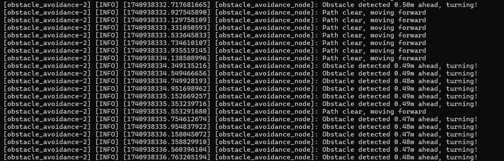

# Autonomous-Robot-Navigation-and-Obstacle-Avoidance-Using-ROS2-and-Gazebo
This repository contains the implementation of an autonomous navigation and obstacle avoidance robot simulated using ROS2 (Humble) and Gazebo. The project features a TurtleBot3 Burger robot navigating a custom hexagonal obstacle course, utilizing LIDAR data for real-time obstacle detection and avoidance. 

---

## Project Overview

The robot autonomously navigates a Gazebo-simulated environment, avoiding obstacles with a custom ROS2 Python node that processes LIDAR data and publishes velocity commands. The system integrates mechanical simulation, sensor processing, and control algorithms, making it a practical example for mechatronics and robotics applications.

## Screenshots

### Gazebo Simulation
  
*The TurtleBot3 navigating a hexagonal obstacle course with LIDAR data visualized.*

### Velocity Commands (/cmd_vel)
  
*Sample output from `ros2 topic echo /cmd_vel`, showing velocity commands (e.g., `angular.z: 0.5` for turning).*

### Obstacle Avoidance Logs
  
*Terminal logs demonstrating real-time obstacle detection and movement adjustments.*

---
### Key Features
- **Obstacle Avoidance**: Detects obstacles within 0.5 meters using LIDAR and adjusts movement (turns right or moves forward).
- **Real-Time Simulation**: Runs in Gazebo with ROS2 Humble, visualized via RViz.
- **Custom Node**: A Python-based ROS2 node (`obstacle_avoidance.py`) handles sensor data and control logic.
- **Documentation**: Includes setup instructions, usage, and troubleshooting for reproducibility.

---

## Prerequisites

### Software
- **Ubuntu 22.04** (recommended for ROS2 Humble).
- **ROS2 Humble** (install via [official guide](https://docs.ros.org/en/humble/Installation.html)).
- **Gazebo** (included with ROS2 Humble).
- **TurtleBot3 Packages**:
  ```bash
  sudo apt install ros-humble-turtlebot3 ros-humble-turtlebot3-gazebo
  ```
- **Python 3.10** (system Python, avoid Conda to prevent version conflicts).
- **pip** (for installing `lxml`):
  ```bash
  pip3 install lxml
  ```

### Hardware
- A computer with at least 8GB RAM to run Gazebo and ROS2 smoothly.

---

## Installation

1. **Clone the Repository**
   ```bash
   git clone https://github.com/anson10/Obstacle-Avoidance-Robot-in-Gazebo-with-ROS2

   cd Obstacle-Avoidance-Robot-in-Gazebo-with-ROS2
   ```

2. **Set Up the Workspace**
   - Create a ROS2 workspace:
     ```bash
     mkdir -p ~/ros2_ws/src
     cd ~/ros2_ws/src
     ```
   - Copy the repository contents into `~/ros2_ws/src/my_robot_navigation`.

3. **Install Dependencies**
   - Ensure `lxml` is installed for Gazebo model spawning:
     ```bash
     pip3 install lxml
     ```
   - Deactivate any Conda environment to use system Python 3.10:
     ```bash
     conda deactivate
     ```

4. **Build the Workspace**
   ```bash
   cd ~/ros2_ws
   colcon build
   source install/setup.bash
   ```

5. **Set Environment Variable**
   - Export the TurtleBot3 model:
     ```bash
     export TURTLEBOT3_MODEL=burger
     ```
   - (Optional) Add to `~/.bashrc` for persistence:
     ```bash
     echo "export TURTLEBOT3_MODEL=burger" >> ~/.bashrc
     source ~/.bashrc
     ```

---

## Usage

1. **Launch the Simulation**
   - Start the project with the launch file:
     ```bash
     ros2 launch my_robot_navigation robot_navigation.launch.py
     ```
   - This opens Gazebo with the TurtleBot3 and runs the obstacle avoidance node.

2. **Visualize in RViz (Optional)**
   - Open a new terminal and launch RViz:
     ```bash
     ros2 run rviz2 rviz2
     ```
   - Configure RViz:
     - Set "Fixed Frame" to `odom`.
     - Add "LaserScan" display for `/scan`.
     - Add "RobotModel" display for the TurtleBot3.

3. **Monitor Topics**
   - List available topics:
     ```bash
     ros2 topic list
     ```
   - View LIDAR data or velocity commands:
     ```bash
     ros2 topic echo /scan
     ros2 topic echo /cmd_vel
     ```

4. **Expected Behavior**
   - Logs indicate "Path clear, moving forward" when no obstacles are near.
   - Logs show "Obstacle detected X.XXm ahead, turning!" when avoiding obstacles (see screenshots).

---


## Code Structure

- **`my_robot_navigation/`**:
  - **`launch/robot_navigation.launch.py`**: Launches Gazebo and the obstacle avoidance node.
  - **`obstacle_avoidance.py`**: Python script for LIDAR processing and velocity control.
  - **`setup.py`**: Configures the ROS2 package and executable.

## Customization

- **Adjust Parameters**: Modify `min_distance` (e.g., `0.5` to `1.0`) or velocities (`linear.x`, `angular.z`) in `obstacle_avoidance.py`.
- **Enhance Algorithm**: Integrate Navigation2 for path planning or add sensor fusion with IMU data.
- **Custom World**: Edit the Gazebo world file to design new obstacle layouts.

## Contributing

Contributions are welcome! Please fork the repository and submit pull requests for:
- Bug fixes or performance improvements.
- Advanced features (e.g., SLAM, machine learning for navigation).
- Documentation enhancements.

## License

This project is licensed under the MIT License. See the [LICENSE](LICENSE) file for details.
